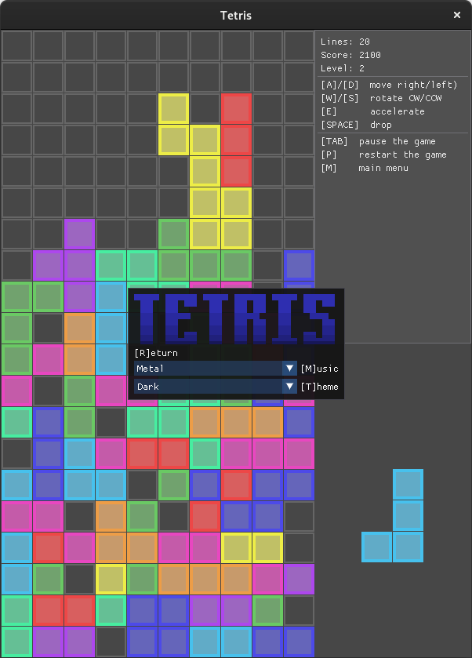
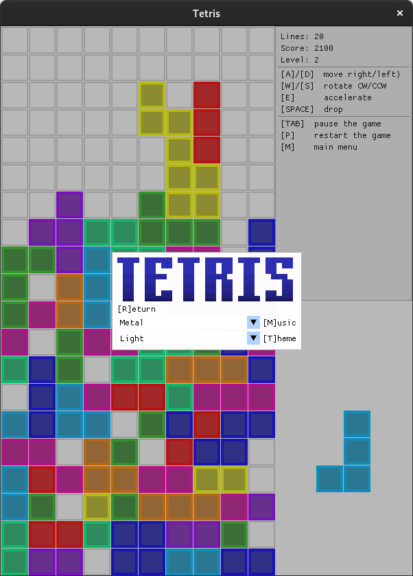

# TETRIS
Just another Classic Tetris implemetation, using SFMLv3, ImGui & ImGui-SFML

## Features
- Theming (light/dark)
- Music selection (Classic/Metal/Piano)
- Keyboard-only control

## Compiling from source

Clone the project
``` bash
git clone --recurse-submodules https://github.com/umarnurmatov/TETRIS.git
```
then 
``` bash
cd TETRIS/
```

Build and compile it with CMake

``` bash
mkdir build
cmake -B ./build -G Ninja
cmake --build build  --config Release --target all --
cd build/src
./tetris-main
```


## Preview
### Dark


### Light


